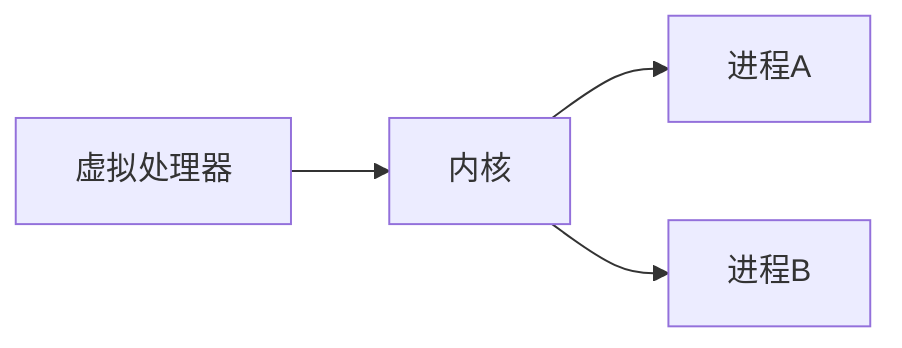

本章的目标是讨论某种操作系统机制对中间件提供分布式资源能力的影响。内核与运行在其上的客户和服务器进程是我们所关心的主要的体系结构组件。内核和服务器进程作用域管理资源和为客户提供资源接口，因此，它们需要具备以下特点：

* **封装：** 它们应该提供有用的能够访问资源的服务接口。
* **保护：** 资源需要被保护以放置非法访问。
* **并发处理：** 客户可以共享资源并能并发的访问它们，资源管理器负责实现并发透明性。

**核心操作系统组件和它们的责任是：**

* **进程管理器：** 负责进程的创建，进程包括一个地址空间和一个或多个线程，是资源管理单元。
* **线程管理器：** 负责线程创建、同步和调度。线程是与进程相关的调度活动。
* **通信管理器：** 负责同一台机器上不同进程中线程之间的通信。一些内核也支持远程进程的线程之间通信。
* **内存管理器：** 负责管理物理内存和虚拟内存。
* **底层管理器：** 负责处理中断、系统调用陷阱和其他异常，同时控制内存管理单元和硬件缓存以及处理器和浮点寄存器操作，在windows中，这被称为硬件抽象层。

### 内存对进程访问权限控制的细节

1. 内核在系统初始化适合就一直保持着运行并且对其主机的物理资源有完全的访问权限。特别是，它可以控制内存管理单元并设置处理器的寄存器，这就使得没有其他代码能够访问机器的物理资源，除了以内核允许的方式。
2. 大多数处理器有硬件模式的寄存器，它们的设置决定了特权指令能否被执行，例如有些指令决定内存管理单元当前采用哪一个保护表。内核进程在处理器的管理（特权）模式下执行，而内核安排其他进程在用户（非特权）模式下进行。
3. 内核通过建立地址空间来保护自己和其他进程以放置异常进程的访问，同时也为正常进程提供它们所需要的虚拟内存。一个地址空间是若干虚拟空间的集合，其中每一个区域都被赋予特定的访问权限。进程不能访问自己地址空间以外的内存空间。*用户进程* 表示在用户模式下执行并拥有用户级地址空间的进程。
4. 当一个进程执行用户程序代码时，在用户及地址空间中执行，而当这一进程执行内核代码时，它在内核地址空间执行，通过中断和系统调用陷阱，进程可以安全的从用户级地址空间转换到内核地址空间中。系统调用陷阱是一个机器级指令TRAP实现，将处理器转换为管理模式，并将地址空间切换到内核地址空间。
5. 内核的保护机制使程序执行会产生额外的开销。在地址空间之间切换会占用处理器的许多处理周期，系统调用现金也要比简单的过程调用要耗费更多的处理器资源。

**共享内存区域的应用：**

* **库：** 库的代码可以很大，如果每一个进程都独立的加载这个库，那么会占用相当大的内容。相反，可以将库代码的一个拷贝映射到需要它的多个进程的共享内存区，达到共享的目的。
* **内核：** 内核带啊吗和数据经常会被映射到每一个地址空间的相同位置，这样，当进程进行系统调用或者出现异常时，系统不需要切换到新的地址映射集合。
* **数据共享与通信：** 两个进程之间或进程与内核之间需要共享数据以达到协同工作的目的。将共享数据映射到相应的两个地址空间中的特定区域比将共享数据放在消息中传递的效率更高。

**写时拷贝：** 从父进程拷贝一个继承的区域时，默认情况，区域被拷贝，但是没有进行物理拷贝，组成继承区域的页面帧被两个地址空间共享，只有当其中一个进程试图修改区域内的页面内容时，系统才会进行物理上的拷贝。

## 线程

**多线程服务器的体系结构：**

* **一请求一线程体系结构：** IO线程为每一个请求派生一个新的工作线程，当工作线程处理完指定远程对象的请求时，会销毁自己。这种体系结构的优点是线程不会竞争共享队列，吞吐量被提高到最大限度。缺点是创建和销毁线程的巨大开销。
* **一连接一线程体系结构：** 为每个连接分配一个线程，服务器在客户建立连接时候创建一个新的工作线程，并在客户关闭连接时销毁该工作线程。
* **一对象一线程体系结构：** 将每个远程对象分别与一个线程相连，一个IO线程接受请求并将其放入队列等待工作线程处理。

**线程与进程的比较：**

* 在一个已有进程创建一个线程比创建一个进程开销小。
* 在进程的不同线程之间切换比在不同进程的线程之间切换的开销小。
* 与多进程相比，一个进程内的线程可以方便有效的共享数据和其他资源。
* 线程不能放置同一进程内其他线程的非法访问。

**用户级线程的优点：**

* 某些线程操作的开销小，如同一进程内的线程间切换不必涉及系统调用，而系统调用需要陷入内核，开销是比较大的。
* 若线程调度模块是在内核外部实现的，那么，它可以被定制或改变以满足特定应用的需求。
* 能支持比内核默认提供的更多的用户级线程。

**虚拟处理器分配给进程：**



**在用户级调度器和内核之间的事件：**

```sequence
进程 -> 内核 : 需要进程
进程 -> 内核 : 进程空闲
内核 -> 进程 : 加入进程
内核 -> 进程 : SA被抢占
内核 -> 进程 : SA被解除阻塞
内核 -> 进程 : SA被阻塞
```

如上图，SA是调度器激活(scheduler activation)，是一个从内核到进程的调用，内核通知用户的四种事件分别是：

* **虚拟处理器已分配：** 内核以及将一个新的虚拟处理器指派给这个进程，并且这是其上的第一个时间片，调度器可以用一个READY状态线程的上下文载入SA，这样，线程可以重新开始执行。
* **SA被阻塞：** SA在内核中被阻塞，内核准备使用一个新的SA来通知调度器，调度器将相应县城状态设置为BLOCKED，并且分配一个READY线程用于通知SA。
* **SA被解除阻塞：** 在内核中被阻塞的SA被解除阻塞，并准备好可以再次在用户级执行。调度器可以将相应的线程插入到READY列表中。为了创建用于通知的SA，内核或者为进程分配一个新的虚拟处理器，或者抢占同一进程上的另一个SA，在后一种情况，它还会将抢占事件告知调度器，调度器可以重新评估线程分配到SA的情况。
* **SA被抢占：** 内核从这个进程夺走一个SA，调度器将被抢占的线程放在READY里欸包中，重新评估线程分配情况。

**一个典型的RPC调用步骤：**

* 一个客户存根程序将调用参数编码为消息，并将请求消息发送出去，然后接收应答消息，并将其解析。
* 在服务器端，一个工作线程接收到达的请求，或者由一个I/O线程负责接收请求，并将其传递给工作线程。不论在哪种情况下，都要调用合适的服务器存根程序。
* 服务器存根程序将请求消息解码，调用指定的过程并将应答消息编码发送出去

**一个远程调用的时间开销：**

1. 网络传输时间

2. **编码：** 编码和解码涉及拷贝和转换数据，当数据量增加时，这是一个显著增加的时间开销。

3. **数据拷贝：** 即使在编码后，在一个远程调用中，消息数据也可能被多次拷贝。

   * 跨越用户 - 内核边界时，在客户或服务器地址空间和内存缓冲区之间

   * 跨越每个协议层时，例如RPC/UDP/IP/以太网

   * 在网络接口和内核缓冲区之间

     其中网络接口和贮存直接是DMA直接内存访问，其他拷贝则是由处理器处理的。

4. **线程调度和上下文切换：** 

   * 当存根程序调用内核的通信操作时，在一个远程调用过程会产生几个系统调用（上下文切换）
   * 调度一个或多个服务器线程
   * 如果操作系统采用单独的网络管理器，那么每次Send操作都会涉及线程的上下文切换

5. **确认等待：** RPC协议的选择会影响延迟，特别是有大量数据传输的时候。

## 操作系统的体系结构

一个开放的分布式系统应该达到以下要求：

* 在每台计算机上仅云星星那些在系统体系结构中承担特定角色的系统软件。
* 允许实现特定服务的软件能独立与其他部分而被更换。
* 当需要适应不同用户或应用时，允许提供同一服务的不同实现。
* 在不破坏已有系统的一致性的情况下加入新的服务。

**整体内核和微内核的比较：**

|  分类  | 整体内核                                 | 微内核                                                       |
| :----: | :--------------------------------------- | :----------------------------------------------------------- |
|  定义  | 内核庞大，执行基本的操作系统功能         | 内核只提供最基本的抽象，主要为地址空间、线程和本地进程间通信 |
| 模块化 | 否                                       | 是                                                           |
|  优点  | 操作调用效率高（但是系统调用效率仍然低） | 可扩展性和内存保护边界基础上增强模块化的能力                 |

### 操作系统层的虚拟化

虚拟化的四个应用场景：

* 在服务器机器上，一个组织为它提供的每个服务都分配一台虚拟机，接着，将虚拟机以最佳方式分配到物理服务器上。与进程不同，虚拟机可以很简单的迁移到其他物理机器上，这增加了管理服务器基础设施的灵活性。
* 虚拟化与云计算相关，云计算采用了这样的一个模型，作为一个服务，提供云上创建的存储、计算和高层对象。云计算首先被虚拟化直接驱动，允许为云的用户提供一个或多个虚拟机，供用户自己使用。
* 分布式应用的需求也激发虚拟化解决方案的开发者去以很少开销创建和销毁虚拟机。在可能需要动态的请求资源的应用中，这也是必要的。
* 在单个物理机上提供对几个不同操作系统环境的便利访问，虚拟化可用于在一台物理体系结构上提供多种操作系统类型。

**虚拟化与微内核的差别：** 虽然微内核支持多个操作系统的共同存在，到那时是通过在微内核提供的可重用的构建块上模拟操作系统实现的。而在操作系统虚拟化中，一个操作系统直接运行在虚拟化硬件（或者少量修改）。虚拟化的核心优势与它优于微内核的主要理由是应用无需被重写或者重编译即可运行在虚拟化环境中。

**实例研究：系统虚拟化的Xen方法**


整体体系结构如上，Xen虚拟机监控器（超级管理程序）是这个体系结构的中心，支持底层物理资源（特别是CPU和它的指令集）的虚拟化以及CPU资源和物理内存的调度。超级管理程序总的目标是通过硬件虚拟化提供虚拟机，形成每个虚拟机拥有自己的（虚拟化的）物理机器的表象，以及虚拟资源复用底层物理资源提供支持。

设计策略：

* **Xen主要关注点是隔离：** 包括故障隔离，超级管理程序中的一个故障能使整个系统崩溃。因此，超级管理程序的最小化、可充分测试和无错误是至关重要的。
* 超级管理程序是一项不可避免的开销，因此，尽可能轻量化是至关重要的。

**底层CPU的虚拟化**

*敏感指令：* 所有能改变机器状态从而可以影响其他进程的指令，分为：

* **控制敏感的指令：** 这些指令试图改变系统中资源的配置，例如，改变虚拟内存映射。
* **行为敏感的指令：** 这些指令读取特权状态，通过它揭示物理而非虚拟资源的状况，从而打破虚拟化。

**Xen的调度步骤：**

* 超级管理程序将VCPU调度到底层物理CPU，因此为每个客户提供一部分底层处理时间
* 客户操作系统将内核级线程调度到其已被分配的VCPU上
* 在使用你的情况下，用户空间的线程库将用户级的线程调度到可用的内核层线程

**Xen的信用调度器：** 对于这个调度器，它给每个VCPU分配权重(weight)和容量(cap)，权重代表应该给VCPU多少真实CPU份额，容量是一个百分比，表示应该被给予相应VCPU的CPU总百分比。这个容量可以指定为不受上限限制的调度器将一个与VCPU相关联的权重转化为信用，当VCPU运行时，它消耗信用。对任何一个CPU，调度器维护一个可运行的VCPU队列。

**Xen的虚拟内存管理：**

虚拟内存管理是虚拟内存最复杂的部分，一部分是因为针对内存管理的底层硬件解决方案的复杂性，一部分是因为需要插入用于保护的额外曾以便提供不同域之间的隔离。Xen采用三层体系结构，既管理物理内存的超级管理程序，提供为物理内存的客户操作系统内核，以及提供虚拟内存的操作系统中的应用。

## Q & A

**1. 在UNIX文件服务的例子中，讨论封装、并发处理、保护、名字解析、参数和返回结果的通信以及调度。**

**封装：** UNIX文件服务提供了对文件读取的方法。read和write，**并发处理：** 客户对文件的操作的文件描述符是各自进程保存的，客户可以共享、并发的访问。**保护：** UNIX文件系统设置了三类读写执行权限，用户、用户组、其他，没有相应权限的用户/用户组，不能访问。**名字解析：** 使用的是解析path获取对应的node指定的文件位置，**参数和返回结果的通信及调度：** 文件系统通过内核的文件操作参数，决定是文本返回还是二进制返回，所有的调度由内核控制。

**2. 为什么一些系统接口由专门的系统调用（对内核）实现，而其他一些系统接口基于消息的系统调用？**

因为有些功能是直接由内核实现的，所以这些接口是直接通过专门的内核系统调用直接实现，有些系统接口功能是由另外一些上层服务实现的，所以只能通过基于消息的系统调用实现。

**3. 史密斯认为在他的进程中，每个线程都应该拥有其自己的保护栈，而线程的其他区域必须被完全共享，这样做有意义吗？**

没有意义，保护栈的实现是需要陷入内核的，同一进程内线程通信的高效是建立在不需要通过内核管理。

**4. 信号（软件中断）处理器应属于进程还是线程？**

属于一个线程。

**5. 讨论共享内存区域的命名问题**

共享内存区域是同一片物理内存区域，并可以作为其他地址空间的一个或多个区域，因此进程可以访问共享内存区域中的相同的内存内容，而非共享区域仍然是受到保护的。

**6. 假设要设计一个平衡各计算机负载的方案，你应该考虑如下问题：**

* 这一方案能够满足用户或系统的哪些需求？
* 它能适应哪一种类型的应用程序？
* 怎样度量和以何种精确程度度量其负载？
* 假设进程不能迁移，怎样监控负载和为新的进程选择地点？如果进程能在计算机之间迁移，你的设计将受到哪些影响？进程迁移的开销很大么？

需要能够满足用户动态扩展进程、进程迁移、消息通信安全机制，需要满足系统开销小、充分利用系统资源的需求；能够适应网络请求处理的应用程序；度量负载使用每个计算机的CPU负载度量吧；就通过计算每个计算机的吞吐量和延迟，评估是否可以将新增进程放置在该台计算机下，如果能够迁移，进程通信、消息传递都会需要重新考虑，进程迁移需要通知相关进程，进程重新开辟其运行环境，开销会很大。

**7. 解释在UNIX中区域用写时拷贝的好处，其中在一个exec调用后通常是一个fork调用。在使用写时拷贝的区域是自我拷贝的情况下会发生什么？**

使用写时拷贝，可以减少大量的内存复制拷贝操作。

**8. 一个文件服务器使用缓存，而且其命中率为80%，当服务器在缓存中查找被请求的块时，服务器中的文件操作需要花费5ms的CPU时间，否则它还要再花费15ms用于磁盘IO，对于下面假设的各种情况，估计服务器的吞吐率（平均请求/秒）：**

* 单线程：平均一个请求所需时间为0.8 * 5 + 0.2 * 20 = 8ms，平均请求为125个/秒
* 在一个处理器上运行的两个线程：考虑来1000个请求，则CPU时间为5000ms，IO时间为3000ms，理论吞吐率为1000 / 5 = 200个/秒
* 在两个处理器上运行的两个线程：考虑来1000个请求，则CPU时间为2500ms，IO时间为3000ms，理论吞吐率为1000 / 3 = 333个/秒

**9. 比较工作池多线程体系结构和一请求一线程体系结构。**

**工作池多线程体系结构**，接收请求并排队是通过一个或多个IO线程实现，该线程从一组套接字或端口接受请求，并将它们放在共享的请求队列上以便工作线程检索。这种体系结构的缺点是缺乏灵活性，如果工作线程太少，可能来不及处理所有请求，另一个缺点是在IO和工作线程之间的高层切换，因为它们都对共享队列进行操作。**一请求一线程体系结构** IO为每一个请求派生一个新的工作线程，并且当工作线程处理完制定远程对象的请求时，会销毁自己，这种结构的好处是线程不会竞争共享队列，并且吞吐六被提高到了最大限度，因为IO线程对每个未处理的请求，都会分配一个工作线程来处理，缺点是创建和销毁线程会有巨大开销。**一连接一线程体系结构** 为每一个连接分配一个线程，服务器在每个客户建立连接的时候创建一个新的工作线程，在客户关闭连接的时候销毁该工作线程。这个的优点是服务器可以从降低的线程的管理的开销，缺点是一个连接有多个请求，而其他线程处于空闲时，后面的请求会被延迟。

**10. 什么样的线程操作开销最大。**

不同执行环境的小城间切换，开销是最大的，其次是通过内核切换到统一执行环境的线程间切换，而共享同一执行环境的用户层线程切换，开销是最低的。

**11. spin锁是通过一个原子性的测试-设置指令访问的布尔变量，其用于实现互斥。你能使用spin锁在单进程的计算机上实现线程的互斥么？**

```c
// 线程1
while(true){
    if(GetSpin())
        break;
}
//线程2
while(true){
    if(GetSpin())
        break;
}
```

**12. 解释内核应为用户级线程的实现提供哪些支持，例如在UNIX下用Java语言。**

不知道。

**13. 页失配是用户级线程实现中的问题么**

页失配（page fault）是出现在父子进程共享区域，为了加速效率使用了写时拷贝的技术，当一个进程的线程试图修改这个共享区域时，会产生一个页失配的硬件异常，为子进程分配一个新的内存区域，分离两个进程的共享数据。这个过程的切换应该是需要陷入内核的。

**14. 解释在“调度器激活”设计中使用混合调度方法（而不是纯粹的用户级或内核级调度）的动机**

动机是，既能够获得用户级线程创建和切换开销小的优点，又能够充分利用多处理器。

**15. 为什么线程包会对线程的阻塞或解除阻塞事件感兴趣，为什么会对即将被抢占的虚拟处理器感兴趣**

内核通过事件通知和提供阻塞、抢占线程的寄存器状态来帮助调度，这一方式需要内核能够准确感知线程的阻塞、解除阻塞事件，从而保证当有一个虚拟处理器可以运行时，就不会有用户级线程出去READY状态

**16. 网络传输时间占一个空RPC的总耗时的20%，而它占一个传输1024字节的RPC的总耗时的80%。如果网络由原来的10Mbps升级到100Mbps，这两次操作的网络传输事件将被改善百分之多少？**

空RPC耗时变为原来的(0.8 + 0.2 /10)，那么耗时减少为原来的82%，如果是1028字节的RPC，那么耗时变为原来的(0.2 + 0.8 / 10)，那么耗时减少为原来的28%。说明带宽对大数据量的RPC请求的延迟优化很明显。

**17. 一个空的RMI不包含参数，它调用一个空过程并且不返回结果，其延迟为2ms。情节是导致延迟的原因；在同一个RMI系统中，每1k的用户数据会增加1.5ms延迟。一个客户希望从文件服务器获取32kb的数据，他应该使用一个32kb的RMI还是应该使用32个1kb的RMI？**

延迟的原因有网络延迟，消息的解码编码，数据的拷贝和服务器接收的延迟等。应该使用一个32kb的RMI，因为每个RMI会有固定的开销和延迟，这个延迟数大于网络延迟。

**18. 影响远程调用的哪些因素会影响消息传递？**

都会。

**19. 请解释共享内存区域是如何应用于进程读取内核写的数据的，你的解释应包括实现同步的必要机制**

共享内存可用于用户进程于内核之间或者用户进程之间快速通信。通过在共享区域中写数据和读数据可以实现数据通信，这样实现高效数据传输，而不需要从内核地址空间或向内核地址空间拷贝数据，但是系统调用和软件中断需要同步。

**20. 轻量级过程调用:**

* 能控制其中的并发度么？	----  不能，在同一时间可能有多个线程调用服务器
* 为什么以及如何客户不允许调用服务器的任何代码？ --- 不知道
* LRPC是不是比传统的RPC调用具有相互干扰的风险更大？ ----不是的，LRPC并没有牺牲位置透明性，应用程序并不知道是使用的LRPC还是RPC

**21. 一个客户对一个服务器进行RMI调用，客户需要5ms对每一个请求进行参数计算，并且服务器要花费10ms处理每一个请求。每个send和receive操作的OS处理时间是0.5ms，同时传输每一个请求或者应答消息的时间是3ms，每个消息的编码或解码是0.5ms。在如下情况，讨论客户产生两个请求并返回结果的时间：1. 单线程 2. 单个处理器上的两个线程。如果进程是多线程的，需要使用异步RMI么？**

单线程：单个请求 5 + 10 + 0.5 * 2 + 3 * 2 + 0.5 * 2 = 23ms，两个请求需要46ms

单处理器上多线程发送：

可以考虑使用异步RMI，可以减少线程等待的开销

**22. 解释什么是安全性策略，在像UNIX这样的多用户操作系统中，相对应的机制是什么？**

不知道。

**23. 解释当服务器动态载入内核地址空间内时，程序必须要满足的连接要求，并说明这种情况与在用户级执行服务器的区别**

不知道。

**24. 中断是怎样与用户级服务器通信的？**

不知道。

**25. 在某个计算机上，我们预计，不管其运行那种OS，线程调度花费50us，一个空过程调用花费1us，上下文切换到内核花费20us，一个域转换花费40us，在使用Mach和SPIN操作系统的情况下，估计客户调用动态载入的空过程的开销**

不会。

**26. Xen提倡的虚拟化方法和Exokernel项目提供的微内核风格，两者的区别是什么？给出两个共同的和两个不同点。**

共同点：1. 都是对接硬件的一层软件，2. 都封装了一些硬件操作。

不同点：1. 虚拟化方法的上层对应的是操作系统，内核上层对应的是应用进程；2. 虚拟化方法对CPU也做了虚拟化，提供了调度CPU的功能划分。微内核没有。

