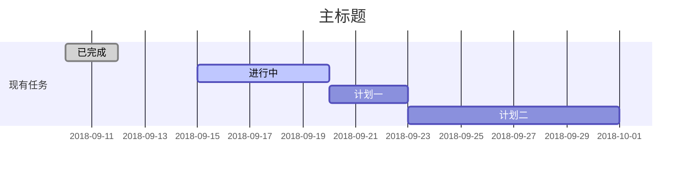
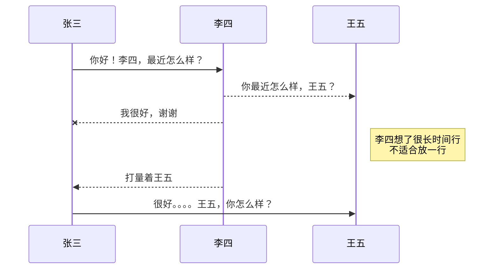
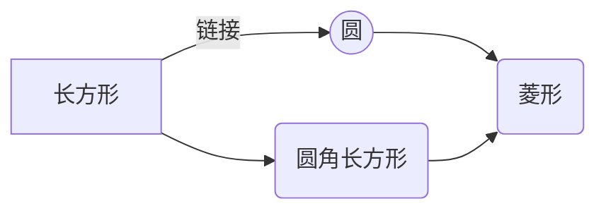

发现了一个整理的很好的markdown使用手册，来自CSDN([https://mp.csdn.net/mdeditor#](https://mp.csdn.net/mdeditor#))，测试展现使用typora软件。

## 最常用的标记

**标题（H1-H6):**

```markdown
## H2 word
#### H4 word
###### H6 word
```

**表现为：**

## H2 word

#### H4 word

###### H6 word

**强调、加粗、删除、引用文字：**

```markdown
*强调文字* 
**加粗文字**
~~删除文字~~
==高亮文字==
> 引用文字
`保留标记的文字"hehe"--haha--**hoho**`
上标文字^666^ 下标文字~222~ H~2~O
```

**表现为：**

*强调文字*

**加粗文字**

~~删除文字~~

==高亮文字==

> 引用文字

`保留标记的文字"hehe"--haha--**hoho**`

上标文字^666^ 下标文字~222~ H~2~O

**插入图片：**

```markdown
链接：[link](http://p9zl5r4hu.bkt.clouddn.com/myzergicon.png)
图片：
带尺寸图片：
```

**表现为：**

链接：[link](http://p9zl5r4hu.bkt.clouddn.com/myzergicon.png)

图片：

带尺寸图片：

typora不支持带尺寸。。。

**列表生成：**

```markdown
- 一级项目
  - 二级项目
    - 三级项目
    
1. 项目1
2. 项目2
3. 项目3

- [ ] 未勾选任务
- [x] 勾选任务
```

**表现为：**

- 一级项目
  - 二级项目
    - 三级项目

1. 项目1
2. 项目2
3. 项目3

- [ ] 未勾选任务
- [x] 勾选任务

**表格生成：**

```markdown
普通表格|值
-------|---
行1|列
行2|列

|设定对齐方式的表格|左对齐|居中|右对齐|
|:----------:|:-----|:-:|---:|
|效果|左对齐|居中|右对齐|
```

**表现为：**

| 普通表格 | 值   |
| -------- | ---- |
| 行1      | 列   |
| 行2      | 列   |

| 设定对齐方式的表格 | 左对齐 | 居中 | 右对齐 |
| :----------------: | :----- | :--: | -----: |
|        效果        | 左对齐 | 居中 | 右对齐 |

**自定义列表的生成：**

```markdown
姓名
: zergzz
性别
: 男
爱好
: coding
: hiking
: playing games
```

姓名
: zergzz
性别
: 男
爱好
: coding
: hiking
: playing games

(好吧，typora不支持这样的方式)

**创建一个注脚和注释：**

```markdown
一个具有注脚的文本。[^2]
[^2]: 注脚的解释

markdown将文本转换而为HTML。
*[html]: 超文本标记语言
```

**表现为：**

一个具有注脚的文本。[^2]

[^2]: 注脚的解释

markdown将文本转换而为HTML。

*[HTML]: 超文本标记语言（Typora不支持这种形式）

## 高级功能

**KaTeX数学公式：**

可以使用LaTex数学表达式[KaTex](https://khan.github.io/KaTex)

```markdown
Gamma公式展开$\Gamma(n)=(n-1)!\quad\forall n\in\mathbb N$是通过欧拉积分

$$
\Gamma(z)=\int_O^\infty t^{z-1}e^{-t}dt\,.
$$
```

**表现为：**

Gamma公式展开$\Gamma(n)=(n-1)!\quad\forall n\in\mathbb N$是通过欧拉积分
$$
\Gamma(z)=\int_O^\infty t^{z-1}e^{-t}dt\,.
$$
**甘特图、流程图表现：**

```markdown
​```mermaid
gantt
	dateFormat YYYY-MM-DD
	title 主标题
	section 现有任务
	已完成: done, des1, 2018-09-10,2018-09-12
	进行中: active, des2, 2018-09-15,5d
	计划一:         des3, after des2, 3d
	计划二:         des4, after des3, 8d
​```
```

**表现为：**



**UML图标：**

```markdown
​```mermaid
sequenceDiagram
张三 ->> 李四:你好！李四，最近怎么样？
李四 -->> 王五:你最近怎么样，王五？
李四 --x 张三:我很好，谢谢
Note right of 王五: 李四想了很长时间换行<br/>不适合放一行

李四 -->> 张三: 打量着王五
张三 ->> 王五: 很好。。。。王五，你怎么样？
​```
```

**序列图展现为：**



**流程图：**

```markdown
​```mermaid
graph LR
A[长方形] -- 链接 --> B((圆))
A --> C(圆角长方形)
B --> D(菱形)
C --> D
​```
```

**展现为：**



**流程图：**

```markdown
​```mermaid
flowchat
  st => start: 开始
  e => end: 结束
  op => operation: 我的操作
  cond => condition: 确认？

  st -> op -> cond
  cond(yes) -> e
  cond(no) -> op
​```
```

**展现为：**

```mermaid
flowchat
  st => start: 开始
  e => end: 结束
  op => operation: 我的操作
  cond => condition: 确认？

  st -> op -> cond
  cond(yes) -> e
  cond(no) -> op
```

(不支持，好像是只能使用typora的flow属性)，如下

```markdown
​```flow
st=>start: Start
op=>operation: Your Operation
cond=>condition: Yes or No?
e=>end

st->op->cond
cond(yes)->e
cond(no)->op
​```
```


```flow
st=>start: Start
op=>operation: Your Operation
cond=>condition: Yes or No?
e=>end

st->op->cond
cond(yes)->e
cond(no)->op
```


