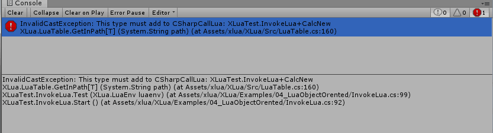

### XLua使用

#### 1. 安装

下载Xlua项目，地址：<https://github.com/Tencent/xLua>，放置在自己的unity项目Assets下即可

#### 2. 使用中注意事项

1. 如果需要使用反射机制在c#调用lua方法，在unity编辑器的xlua目录下使用`XLua>Generate Code` 生成中间代码。

2. 如果上一步生成失败，

   这个报错一般是因为项目内没有默认使用Assembly-CSharp导致的，相关代码在Generator.cs和Hotfix.cs中，将其替换为自己的main dll名称即可。

3. 