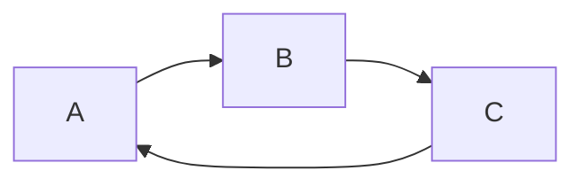
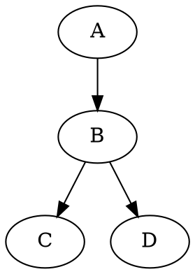

```flow
st=>start: Start:>http://www.google.com[blank]
e=>end: End:>https://www.baidu.com
op=>operation: Operation
sub1=>subroutine: My Subroutine
cond=>condition: Yes or No
io=>inputoutput: Catch something...

st->op->cond 
cond(yes)->io->e
cond(no)->sub1(right)->op
```

```sequence {theme="hand"}
Andy->China: Say Hello
Note right of China: China thanks\n about it
China->Andy: How are you?
Andy->China: Im Ok
```




```wavedrom
{ signal: [
    { name: 'clk', wave: 'p..Pp..P'},
    ['Master',
        ['ctrl',
            {name: 'write', wave: '01.0....'},
            {name: 'read', wave: '0...1..0'}
        ],
        {name: 'addr', wave: 'x3.x4..x', data: 'A1 A2'},
        {name: 'wdata', wave: 'x3.x....', data: 'D1'},
    ],
    {},
    ['Slave',
        [
            'ctrl',
            {name: 'ack', wave: 'x01x0.1x'},
        ],
        {name: 'rdata', wave: 'x.....4x', data: 'Q2'},
    ]
]}
```



```vega-lite
{
    "$schema": "https://vega.github.io/schema/vega-lite/v2.json",
    "description": "A simple bar chart with embedded data.",
    "data":{
        "values": [
            {"a": "A","b": 20},
            {"a": "B", "b": 55},
            {"a": "C", "b": 43},
            {"a": "D", "b": 25},
            {"a": "E", "b": 9}
        ]
    },
    "mark": "bar",
    "encoding":{
        "x": {"field": "a", "type": "ordinal"},
        "y": {"field": "b","type":"quantitative"}
    },
    "width": 500,
    "height": 400
}
```
